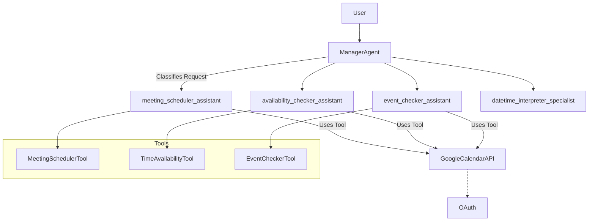
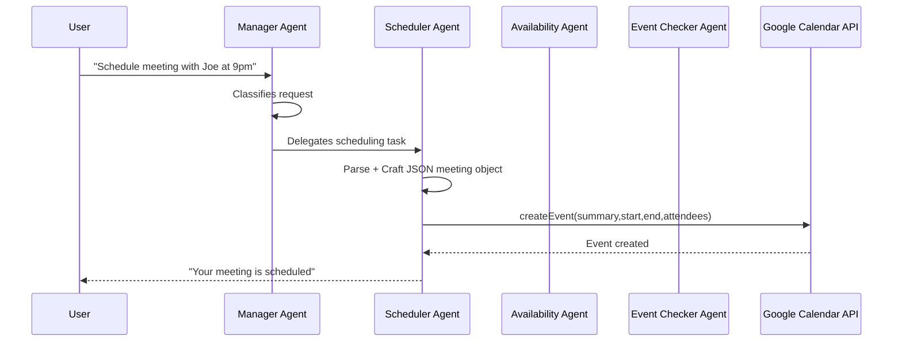
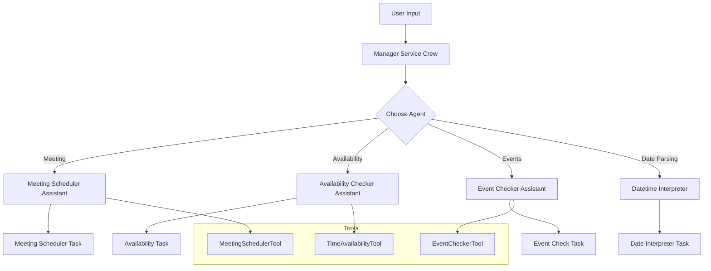

# 🚀 CrewAI Calendar Assistant — Multi‑Agent + Google Calendar + Ollama


---

# 📌 Overview

This project is a **production‑grade multi‑agent workflow** built using:

- **CrewAI** – Agent orchestration  
- **Ollama** – Local LLM inference (Llama 3.1 8B)  
- **Google Calendar API** – Scheduling, availability, event retrieval  
- **Custom Planning Manager Agent** – Routes requests to the correct specialist agent  
- **Custom Tools** – Python functions exposed as agent tools  
- **Structured Outputs** – Pydantic models for Meeting crafting + date interpretation  

This repository demonstrates a **real‑world agent system**, capable of:

- Understanding user natural language  
- Interpreting dates  
- Checking availability  
- Scheduling meetings  
- Creating Google Calendar events  
- Running local LLM pipelines (offline, secure)  

---

# 🏗️ Architecture Diagram



---

# 🔁 Sequence Diagram — Full Multi‑Agent Flow



---

# 🧠 CrewAI Flow Diagram



---

# 📂 Project Structure

```
crewai-lab/
├── pyproject.toml
├── .gitignore
├── src/
│   └── calendar_assistant_flow/
│       ├── main.py
│       ├── models.py
│       ├── crews/
│       │   ├── Assistant_crew/
│       │   │   ├── assistant_crew.py
│       │   │   ├── config/
│       │   │   │   ├── agents.yaml
│       │   │   │   └── tasks.yaml
│       │   ├── Manager_crew/
│       │   │   ├── manager_crew.py
│       │   │   ├── config/
│       │   │   │   ├── agents.yaml
│       │   │   │   └── tasks.yaml
│       ├── tools/
│           ├── custom_tool.py
│           └── __init__.py
└── README.md
```

---

# ⚙️ Installation

```bash
git clone https://github.com/santoshhub/agentic-ai-lab
cd agentic-ai-lab/crewai-lab
uv venv
uv pip install -r requirements.txt  # or pyproject.toml via uv sync
```

---

# 🔥 Running the Flow

```bash
crewai flow kickoff
```

---

# 🤖 Running Ollama (Required)

Install Ollama:

```bash
brew install ollama
```

Start server:

```bash
ollama serve
```

Download model:

```bash
ollama pull llama3.1:8b
```

Verify:

```bash
curl http://localhost:11434/api/tags
```

---

# 🔐 Google Calendar Setup

1. Visit Google Cloud Console  
2. Enable Calendar API  
3. Create OAuth client ID  
4. Download `credentials.json`  
5. Place it in project root (`crewai-lab/`)  
6. First run triggers OAuth login  
7. Token saved automatically to `token.pickle`

---

# 🧪 Example Flow Request

> "Please schedule a daily standup with joe@gmail.com today at 9pm and check my availability."

System produces structured JSON → schedules the meeting → confirms back.

---

# 🧩 Key Features

- Multi‑agent collaboration  
- Supervisor agent (routing logic)  
- Custom Google Calendar tools  
- Offline LLM reasoning with Ollama  
- Strong structured output enforcement  
- Pydantic typing for deterministic tasks  
- Clean CrewAI orchestration  
- Extendable architecture  

---

# 🛠️ Roadmap

- Add MCP server for exposing tools  
- Add Langfuse tracing  
- Add UI (Streamlit)  

---

# 📄 License

MIT © 2025 Santosh Shahane
